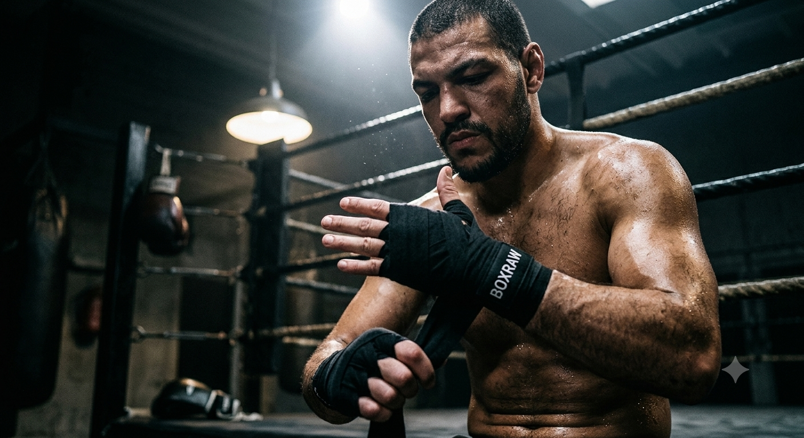
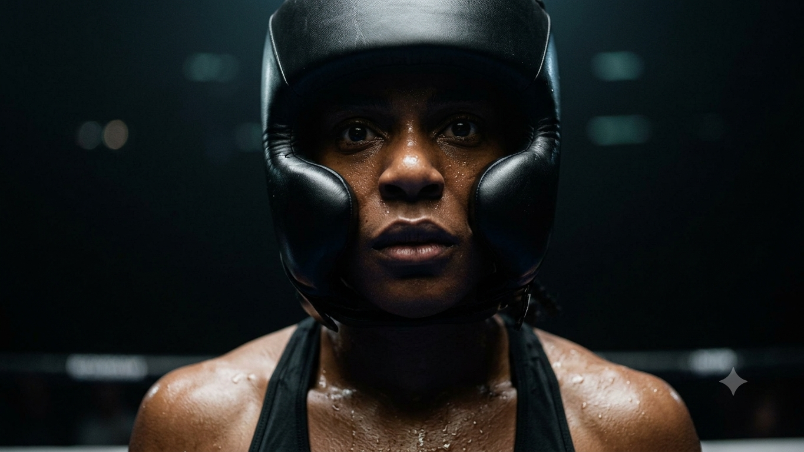
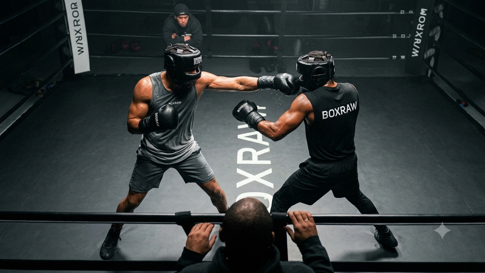
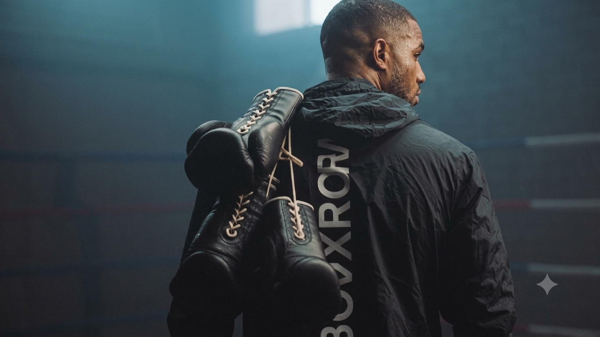

# B1-2_Codyssey
멀티모달 콘텐츠 제작

# 스토리보드

---

<aside>

  ### 브랜드 아이덴티티

| **브랜드 이름** | BOXRAW |
| --- | --- |
| **타겟** | 복싱을 즐기거나 배우는 모든 사람들 |
| **톤앤매너** | 톤 : 진지하고 철학적이며 진정성 있는 목소리 매너 : 거칠지만 세련되었고, 전통을 중요시하지만 현대적 느낌 |
| **차별점** |   • ‘복싱 전용’ 이라는 점을 강조한 니치 마케팅 • 진정성 있는 스토리텔링과 커뮤니티 활동(자선 활동 : Boxing is love) |

#### 핵심 메시지

> ✉️ **“WE DON’T PLAY BOXING”**
> 
> 
> → 아래 3가지 가치가 복싱에 담겨 있다고 믿는 브랜드로 복싱을 하는 것이 아닌 규율을 세우고 내면의 평화를 찾고 이를 통해 세상에 사랑을 나눈다.
> 
- **규율** : 어려움을 속일 수 없습니다. 목표를 세우고, 실천하며, 실패에 책임을 지세요. 규율 있는 사고와 행동으로 어떤 과제도 극복할 수 있습니다.
- **마인드풀니스** : 복싱을 할 때 마음이 맑아집니다. 현재에 집중하고, 자신과 목표에만 몰입하세요. 모든 일을 명확하고 집중력 있게 하세요.
- **사랑** : 우리 체육관에는 거짓과 속임수가 없습니다. 진실만을 말하며, 때로는 아플 수 있어도 진실이 성공과 최고의 자신을 만드는 길임을 믿습니다.

</aside>

<aside>
  
### 사용 도구 목록

| 도구 | 용도 | 특징(선정 이유) |
| --- | --- | --- |
| OpenAI Sora 2(API) | 영상 생성 | 가성비가 좋고 프롬프트를 그대로 표현하는 능력 우수 |
| Gemini 2.5 pro(API) | 목소리 생성 | 목소리와 억양이 다양하고 자연스러움 |
| Gemini 3.5 flash(WEB) | 이미지 생성 | 속도가 빠르고 사용자의 의도에 가깝게 이미지 생성 |
| ACE Studio(WEB) | 배경음악 생성 | AI가 영상을 직접 해석해서 그에 맞는 음악을 제작 |
| Final Cut PRO | 자막 및 컷편집 | Apple사의 영상 편집 프로그램 |

#### 🔄 수정 과정 비교

| 수정 전 프롬프트 | 수정 후 프롬프트 |
| --- | --- |
| A cinematic top-down view of a boxing ring. Two boxers wearing headgear with white 'boxraw' logos are sparring. A large 'boxraw' logo is printed on the center of the ring floor. One boxer throws a sharp jab, and the other boxer smoothly ducks to evade the punch. In one corner, a coach (second) is reaching out with his hand, shouting instructions. In the opposite corner, another coach watches the fight intensely, analyzing the opponent's movement. Natural slow motion, dramatic cinematic spotlight, high contrast with deep shadows, photorealistic, 8k, gritty texture. | A cinematic top-down view of a boxing ring. Two boxers wearing headgear with white 'boxraw' logos are sparring. A large 'boxraw' logo is clearly visible on the center of the ring floor. One boxer throws a sharp jab, while the other boxer ducks to evade the punch. Outside the ring, one coach is reaching out his hand and shouting instructions to his fighter. On the opposite side outside the ring, another coach is intensely watching the match, analyzing the opponent's movements. Natural slow motion, dramatic cinematic spotlight, high contrast with deep shadows, photorealistic, gritty skin textures, 8k. |
- 수정 전 프롬프트에서는 one corner라는 표현으로 인해서 링 안에 코치들이 서 있는 장면으로 출력되었다. 그래서 Outside the ring이라는 더 직관적인 표현을 사용해 최종 결과물에는 정상적으로 링 밖에서 선수를 코칭하는 모습으로 출력하였다.
</aside>

<aside>
  
### 씬 구성

#### 🎞️ [Scene 1] 규율(Discipline)

| **Run time** | 00:00:02:09 |
| --- | --- |
| Message | 어려움을 속일 수 없습니다. 목표를 세우고, 실천하며, 실패에 책임을 지세요. 규율 있는 사고와 행동으로 어떤 과제도 극복할 수 있습니다. |
| Video Prompt (eng.) | A boxer sitting outside the ring in a dark boxing gym, wrapping his left hand. His right hand is pulling a black handwrap tightly. A white 'BOXRAW' logo is clearly visible on the stretched black fabric. Cinematic top-down spotlight, rim lighting highlighting sweat and gritty skin texture, high contrast, deep shadows, photorealistic, Shot from a diagonal angle, natural slow motion |
| Video Prompt (kor.) | 어두운 복싱 체육관. 복서가 링 바깥에 앉아 오른손으로 검은색 핸드랩을 팽팽하게 당겨 왼손에 감고 있습니다. 팽팽해진 검은색 핸드랩과  흰색 boxraw로고가 보입니다. 시네마틱 탑다운 스포트라이트, 땀과 거친 피부 질감을 강조하는 림 라이팅. 강한 대비, 깊은 그림자, 실사 같은 |
| Video Result | 링 바깥쪽에 앉아 핸드랩을 감고있는 남성 |
| Copy | DISCIPLINE |

#### 🎞️ [Scene 2] 마인드풀니스 (Mindfulness)

| Run time | 00:00:02:04 |
| --- | --- |
| Message | 복싱을 할 때 마음이 맑아집니다. 현재에 집중하고, 자신과 목표에만 몰입하세요. 모든 일을 명확하고 집중력 있게 하세요. |
| Video Prompt (eng.) | Camera slowly pushes in from a chest shot to an extreme close-up of her eyes. A female boxer standing in the ring, wearing a black tank top with a white 'BOXRAW' logo centered on the chest, and headgear with a white 'BOXRAW' logo. She is taking deep breaths, staring intensely at her opponent before the round starts. The background heavily blurs out (shallow depth of field, bokeh). Smooth slow motion. Cinematic top-down spotlight, rim lighting highlighting sweat and gritty skin texture, high contrast, deep shadows, photorealistic, 8k resolution. |
| Video Prompt (kor.) | 검은 탱크탑에 흰색 boxraw로고가 가슴 정중앙에 그려져있는 옷을 입고 링위에 서있는 여성 복서. 머리에는 흰색 boxraw로고가 새겨진 헤드기어를 쓰고 있다.  라운드가 시작하기 전 상대를 주시한채로 호흡을 안정시키며 몰입하는 중이다. 체스트샷에서 눈으로 빅 클로즈업. 주변의 배경이 아웃포커싱되며 그녀만 스포트라이트를 받으며 오직 앞을 향한 강렬한 시선만 남습니다. 자연스러운 슬로우 모션. 시네마틱 탑다운 스포트라이트, 땀과 거친 피부 질감을 강조하는 림 라이팅, 강한 대비, 깊은 그림자, 실사 같은 |
| Video Result | 경기 시작전 헤드기어를 쓰고 집중하는 여성 복서 |
| Copy | MINDFULNESS |

#### 🎞️ [Scene 3] 사랑&진실 (Love&Truth)

| Run time | 00:00:02:23 |
| --- | --- |
| Message | 우리 체육관에는 거짓과 속임수가 없습니다. 진실만을 말하며, 때로는 아플 수 있어도 진실이 성공과 최고의 자신을 만드는 길임을 믿습니다. |
| Video Prompt (eng.) | A cinematic top-down view of a boxing ring. Two boxers wearing headgear with white 'boxraw' logos are sparring. A large 'boxraw' logo is clearly visible on the center of the ring floor. One boxer throws a sharp jab, while the other boxer ducks to evade the punch. Outside the ring, one coach is reaching out his hand and shouting instructions to his fighter. On the opposite side outside the ring, another coach is intensely watching the match, analyzing the opponent's movements. Natural ‘slow motion’, dramatic cinematic spotlight, high contrast with deep shadows, photorealistic, gritty skin textures, 8k |
| Video Prompt (kor.) | 흰색 boxraw로고가 그려진 헤드기어를 쓴 두 선수가 스파링을 하고 있다. 탑뷰. 링 바닥에는 boxraw의 로고가 크게 보인다. 한 선수가 잽을 던지고 다른 한 선수가 더킹하며 주먹을 피하고 있다. 링 바깥 한쪽 모서리에는 선수에게 코칭하고 있는 세컨드가 손을 뻣으며 지시하고 있다. 반대쪽 링 바깥 모서리에도 다른 한 선수의 세컨이 상대의 움직임을 읽기 위해 경기를 주시하고 있다. 자연스러운 슬로우 모션. 시네마틱 스포트라이트, 강한 대비, 실사 같은 |
| Video Result | 스파링을 하고 있는 두 선수와 이를 돕는 세컨들의 모습 |
| Copy | LOVE&TRUTH |

#### 🎞️ [Scene 4] “We don’t play boxing”

| Run time | 00:00:02:00 |
| --- | --- |
| Message | 복싱을 하는 것이 아닌 규율을 세우고 내면의 평화를 찾고 이를 통해 세상에 사랑을 나눈다. |
| Video Prompt (eng.) | A static camera shot showing the rear view of a man after boxing training. He is standing and looking over his right shoulder. He has laced boxing gloves slung over his back. Composition: The man is positioned in the right-center of the frame (between the center and the right third). He is wearing a windbreaker with a large 'BOXRAW' logo on the back, rotated 90 degrees (vertically aligned). Cinematic lighting, post-workout grit, photorealistic. |
| Video Prompt (kor.) | 남자의 뒷모습이 보이고 남자는 줄달린 복싱 글러브를 뒤로 매고 있어. 평범한 복싱 훈련이 끝난 뒤의 모습이야. 남자는 본인의 오른쪽 어깨너머를 보고 있는 자세로 서있어. 이때 남자는 화면을 3등분했을때  가장 오른쪽 칸과 가운데칸의 중앙 부분에 위치해있도록 카메라가 앵글을 잡고 있어. 남자는 바람막이를 입고 있는데 바람막이 등 부분에는 크게 boxraw로고가 90도 돌아간체로 새겨져있어. 카메라는 뒷모습을 비추는 위치에서 고정되어 있어 |
| Video Result | 훈련을 마친 복싱 선수의 뒷모습 |
| Copy | WE DON’T PLAY BOXING |

### 🎵 배경음악&나레이션

| 항목 | 내용 |
| ----- | ----- |
| **Narration Prompt (Eng.)** | **[Tone & Delivery Style]** • Tone: Calm, steady, and deeply grounded. Speak like a wise mentor or a seasoned observer, not an excited announcer. • Emotion: Sincere and resolute. Deliver the message with quiet strength, avoiding any sudden peaks in pitch or volume. Keep the intonation natural and flat but firm. • Acoustics: Close-mic effect. Soft-spoken but highly clear, like a calm narration in a high-end cinematic documentary.  **[Duration & Pacing Constraints]** • TOTAL DURATION CRITICAL: The entire audio must be completed within 10 to 12 seconds. • Pacing: Deliberate and measured, but strictly managed to fit the time limit. Do not stretch pauses too long. • Timing Breakdown: Divide the text into 4 segments to match 4 video cuts. Allocate approximately 2.5 to 3 seconds per segment (including short, natural pauses). |
| **Narration Result** | #1 : tolerates no compromises. #2 : stares only at the target. #3 : In this ring, there is no room for lies. #4 : we don't play boxing. |
| **BGM Prompt (Eng.)** | Cinematic sports advertisement background track, 10 seconds duration. Starts with an intense, modern, rhythmic industrial beat and ticking sound, building dark tension and grit (0-8 seconds). High energy, passionate, and determined mood. At exactly 8 seconds, a sudden massive, deep sub-bass drop and heavy sub-kick impact hits, coinciding with the "WE DON'T PLAY BOXING" text appear on screen. The music instantly cuts off cleanly into absolute silence immediately after the heavy bass impact, leaving a dramatic lingering finish. No trailing reverb, clean cut-off at the end. Instruments: Industrial synths, heavy pounding drums, booming sub-bass. |
| **BGM Result** | [BGM.mp3](./02.Source/bgm.mp3) |
</aside>

<aside>
  
### ✅ 최종 결과물

| 파일명 | [Boxraw ad.mov](./02.Source/Boxraw%20ad.mov) |
| --- | --- |
| 길이 | 00:10 |
| 해상도 | 1280x720 |
| 프레임레이트 | 23.98p |
| 코덱 | Timecode, H.264, MPEG-4 AAC |
</aside>
